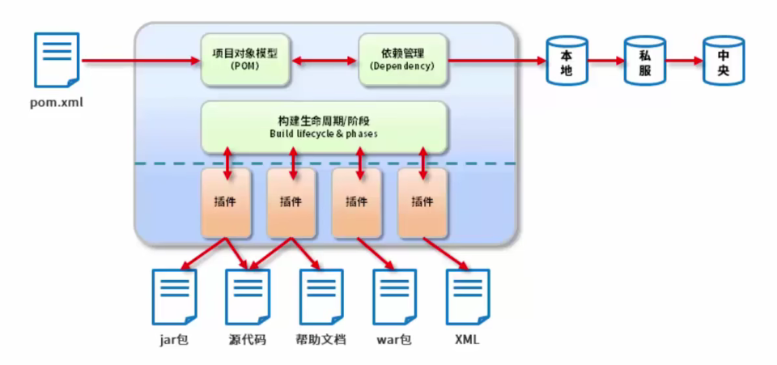

[^时间]: 2023.2.2
[^集数]: P1-P14

### 问题：（1-5了解  6-7熟记）

#### 1.Maven是什么？

#### 2.Maven的作用？

#### 3.POM是什么？

#### 4.Maven基本概念有哪些？

#### 5.Maven构建命令

#### 6.依赖的冲突以及范围

#### 7.pom.xml文件解析


Maven简介：

```text
本质上是项目管理工具，将项目开发和管理过程抽象化一个项目对象模型（简称：POM；全称：Project Object Model）
```

maven对指着中间蓝色的部分


作用：

```text
项目构建：提供标准的、跨平台的的自动化项目构建方式
依赖管理：方便快捷的管理资源（jar包），避免版本冲突
统一开发结构：提供标准的、统一的项目结构
```


概念：

- 仓库：仓库又分为本地仓库与远程仓库，其中远程仓库又细分为中央仓库（Maven团队维护）与私服（部门/公司范围内存储资源，来源于中央仓库，其私服具有保持版权资源，如：购买、自主研发的jar）
- 坐标：识别资源位置


构建命令：

```mvn
mvn compile     #编译
mvn clean       #清理
mvn test        #测试
mvn package     #打包
mvn install     #安装到本地仓库
```


依赖传递冲突：

- 路径优先：相同资源时，层级深，优先级低，层级浅，优先级高

- 声明优先：相同层级时，配置靠前的覆盖配置靠后的

- 特殊优先：同层级配置了相同资源不同版本，后配置的覆盖先配置的

  


依赖范围：


- compile，默认的依赖范围，表示依赖需要参与当前项目的编译，后续的测试、运行周期也参与其中，是比较强的依赖。
- test，表示依赖仅仅参与测试相关的工作，包括测试代码的编译和运行。比较典型的如 junit。
- runntime，表示依赖无需参与到项目的编译，不过后期的测试和运行需要其参与其中。
- provided，表示打包的时候可以不用包进去，别的容器会提供。和 compile 相当，但是在打包阶段做了排除的动作。
- system，从参与程度上来说，和 provided 类似，但不通过 Maven 仓库解析，可能会造成构建的不可移植，要谨慎使用。


**依赖范围传递性：**


关于**传递性依赖**：

比如一个account-email项目为例，account-email有一个compile范围的spring-code依赖，spring-code有一个compile范围的commons-logging依赖，那么commons-logging就会成为account-email的compile的范围依赖，commons-logging是account-email的一个传递性依赖：


有了传递性依赖机制，在使用Spring Framework的时候就不用去考虑它依赖了什么，也不用担心引入多余的依赖。Maven会解析各个直接依赖的POM，将那些必要的间接依赖，以传递性依赖的形式引入到当前的项目中。

关于**依赖可选**：

项目中A依赖B，B依赖于X和Y，如果所有这三个的范围都是compile的话，那么X和Y就是A的compile范围的传递性依赖，但是如果我想X、Y不作为A的传递性依赖，不给它用的话，可以按照下面的方式配置可选依赖：

```xml
<project>  
    <modelVersion>4.0.0</modelVersion>  
    <groupId>com.itwanger</groupId>  
    <artifactId>project-b</artifactId>  
    <version>1.0.0</version>  
    <dependencies>  
        <dependency>  
            <groupId>mysql</groupId>  
            <artifactId>mysql-connector-java</artifactId>  
            <version>5.1.10</version>  
            <!--当前依赖不使用这个包；为TRUE时为排除依赖就是不使用，默认为FALSE-->
            <optional>true</optional>  
        </dependency>  
        <dependency>  
            <groupId>postgresql</groupId>  
            <artifactId>postgresql</groupId>  
            <version>8.4-701.jdbc3</version>  
            <optional>true</optional>  
        </dependency>  
    </dependencies>  
</project>
```

关于**依赖排除**：

有时候你引入的依赖中包含你不想要的依赖包，你想引入自己想要的，这时候就要用到排除依赖了，比如下图中spring-boot-starter-web自带了logback这个日志包，我想引入log4j2的，所以我先排除掉logback的依赖包，再引入想要的包就行了。

```xml
<dependency>
	<groupId>org.springframework.boot</groupId>
	<artifactId>spring-boot-starter-web</artifactId>
	<version>2.5.6</version>
	<exclusions>
		<exclusion>
			<groupId>org.springframework.boot</groupId>
			<artifactId>spring-boot-starter-logging</artifactId>
		</exclusion>
	</exclusions>
</dependency>
<!-- 使用 log4j2 -->
<dependency>
	<groupId>org.springframework.boot</groupId>
	<artifactId>spring-boot-starter-log4j2</artifactId>
	<version>2.5.6</version>
</dependency>
```

声明exclustion的时候只需要groupId和artifactId，不需要version元素，因为groupId和artifactId就能唯一定位某个依赖。


pom.xml文件解析：

```xml
<?xml version="1.0" encoding="UTF-8"?>
<project xmlns="http://maven.apache.org/POM/4.0.0" xmlns:xsi="http://www.w3.org/2001/XMLSchema-instance"
    xsi:schemaLocation="http://maven.apache.org/POM/4.0.0 http://maven.apache.org/xsd/maven-4.0.0.xsd">
    <modelVersion>4.0.0</modelVersion>
    <groupId>com.itwanger</groupId>
    <artifactId>MavenDemo</artifactId>
    <version>0.0.1-SNAPSHOT</version>
    <name>MavenDemo</name>
</project>
```

- 第一行是XML头，指定了该xml文档的版本和编码方式。
- project 是根元素，声明了一些POM相关的命名空间及xsd元素。
- modelVersion指定了当前POM的版本，对于Maven 3来说，值只能是4.0.0。
- groupId定义了项目属于哪个组织，通常是组织域名的倒序，比如说我的域名是 [itwanger.comopen](http://itwanger.com/)，所以groupId就是 com.itwanger。
- artifactId定义了项目在组织中的唯一ID。
- version指定了项目当前的版本，SNAPSHOT意为快照，说明该项目还处于开发中。
- name 声明了一个对于用户更为友好的项目名称。

groupId、artifactId和version这三个元素定义了一个项目的基本坐标，在Maven的世界里，任何的jar和pom都是以基于这些坐标进行区分的。

```xml
<project>
...
<dependencies>
    <dependency>
        <groupId>实际项目</groupId>
　　　　 <artifactId>模块</artifactId>
　　　　 <version>版本</version>
　　　　 <type>依赖类型</type>
　　　　 <scope>依赖范围</scope>
　　　　 <optional>依赖是否可选</optional>
　　　　 <!—主要用于排除传递性依赖-->
　　　　 <exclusions>
　　　　     <exclusion>
　　　　　　　    <groupId>…</groupId>
　　　　　　　　　 <artifactId>…</artifactId>
　　　　　　　</exclusion>
　　　　 </exclusions>
　　</dependency>
<dependencies>
...
</project>
```

- dependencies 可以包含一个或者多个dependency元素，以声明一个或者多个项目依赖。
- grounpId、artifactId和version 组成了依赖的基本坐标。
- type 指定了依赖的类型，默认为 jar。
- scope 指定了依赖的范围（详情见上面**依赖范围**部分）。
- optional 标记了依赖是否是可选的（详情见上面**依赖可选**部分）。
- exclusions 用来排除传递性依赖（详情见上面**依赖排除**部分）。

