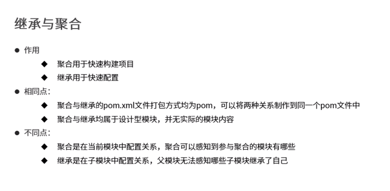
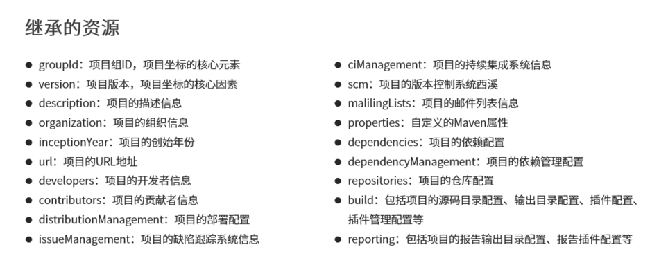

[^时间]: 2023.2.4
[^集数]: P19-P20





### 聚合

**作用：**一个项目包拆分成多个模块后，当一个模块更新，又要重新将每个模块依次手动去更新，那么这时候聚合的作用就出来了，聚合用于快速构建maven工程，一次性构建多个项目/模块。

**制作方式：**

- 首先创建一个空的maven模块，打包类型定义为pom

```xml
<packaging>pom</packaging>
```

- 定义当前模块进行构建操作时关联的其他模块名称

  ```xml
  <modules>
      <!--这里的项目配置顺序没有关系，依赖在加载时，会自己判断顺序-->
  	<module>../ssm_controlle</modeule>
  	<module>../ssm_service</modeule>
  	<module>../ssm_dao</modeule>
  	<module>../ssm_pojo</modeule>
  </modules>
  ```

<u>***附加：**创建项目时，假如不声明打包类型，默认类型为jar。模块类型有三种分别是war、jar和pom*</u>

### 继承

**作用：**通过继承可以实现在子工程中沿用父工程的配置

- maven中的继承与Java中的继承相似，在子工程中配置继承关系

**制作方式：**

- 在子工程中声明其父工程坐标与对应位置

  ```xml
  <!--定义该工程的父工程-->
  <parent>
  	<groupId>com.itheima</groupId>
      <artifactId>ssm</artifactId>
      <version>1.0-SNAPSHOT</version>
      <!--填写父工程的文件-->
      <relativePath>../ssm/pom.xml</relativePath>
  </parent>
  ```

- 在父工程中定义依赖管理

```xml
<dependencyManagement>
        <dependencies>
            <dependency>
                <groupId>org.springframework</groupId>
                <artifactId>spring-context</artifactId>
                <version>5.1.9.RELEASE</version>
            </dependency>
        </dependencies>
    </dependencyManagement>
```

- 在子工程中定义依赖关系，无需声明依赖版本，版本参照父工程中依赖的版本

  ```xml
  		<dependencies>
              <dependency>
                  <groupId>org.springframework</groupId>
                  <artifactId>spring-context</artifactId>
              </dependency>
          </dependencies>
  ```


**继承的资源管理**




